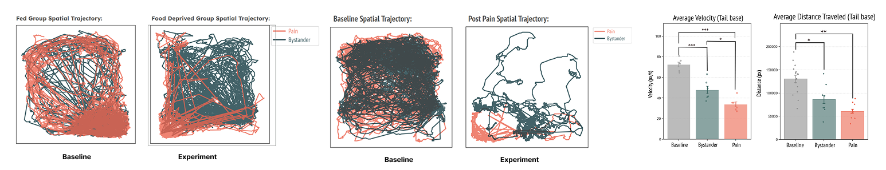

# ML Pose Estimation Pipeline for Behavioral Tracking
### Overview
Investigated the impact of hunger on social pain behaviors by leveraging machine learning–based pose estimation to automate behavioral analysis, reducing manual scoring time, minimizing observer bias, and uncovering data-driven behavioral patterns across conditions.

### Quick Snapshot: Data Visualizations
Key visualizations highlighting behavioral differences across conditions:
- **Movement Trajectories & Spatial Density:** Visualize how mice navigate the enclosure, showing differences in exploration patterns between sated and food-deprived conditions.
- **Behavioral Distribution Comparison:** Quantifies changes in behavior frequency across conditions, with statistically significant correlations observed between the groups.

  

